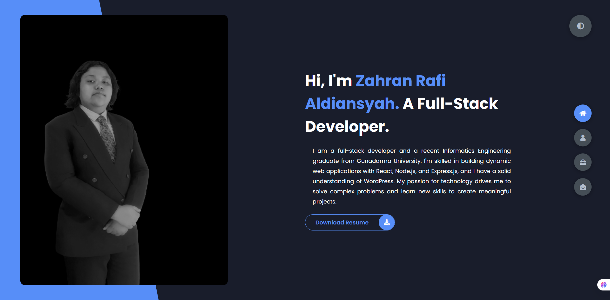
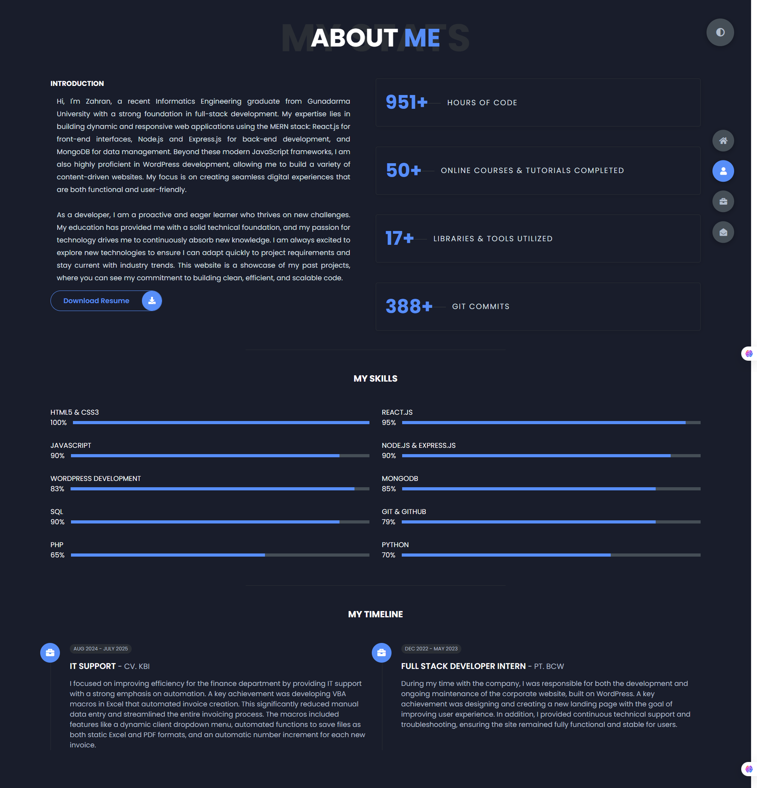
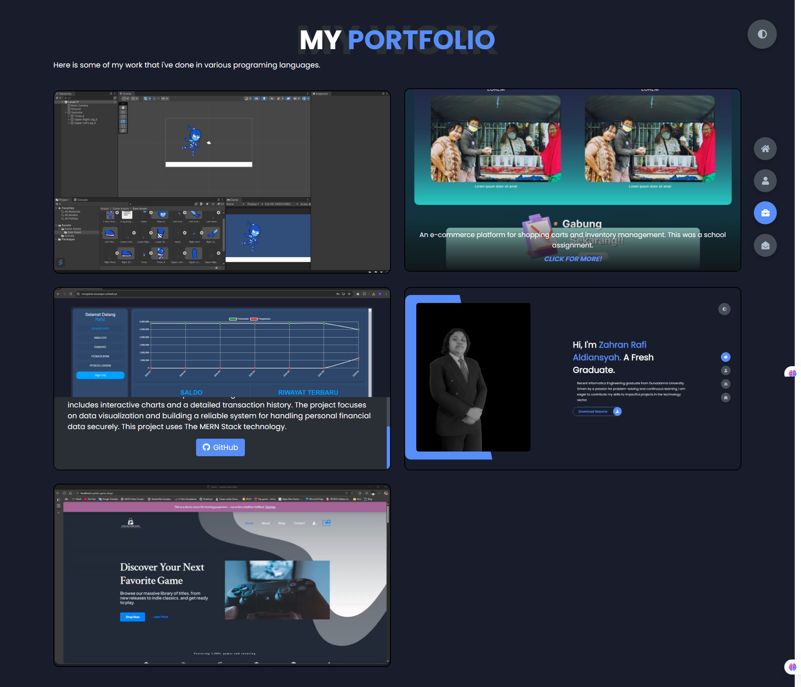
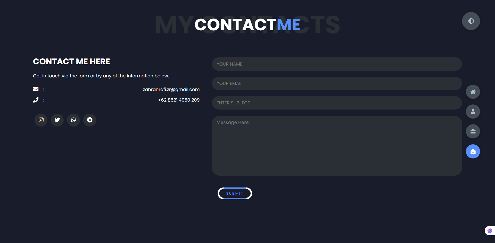

# 📝 Portofolio
Project: "Syntaxis" 💻
A personal portfolio website built from scratch using HTML, CSS, and JavaScript.

# 🌐 Project Overview
This project is a clean, responsive, and interactive portfolio website designed to showcase my skills, projects, and professional experience. This was a personal undertaking that allowed me to apply and strengthen my development abilities. While the core structure is complete, I'm marking it as "done" for now to reflect its current state as a functional, elegant online resume. It serves as both a showcase of my work and a testament to my dedication to crafting a strong web presence.

Project Status: The project is functionally complete, but I may add new features or projects in the future.

Why this project? I wanted to create a professional platform that I had full control over, without relying on templates or website builders. This project allowed me to demonstrate my understanding of core web technologies and design principles.

# 💻 Technologies Used
Markup Language: HTML5 (for semantic structure)

Styling: CSS3 (for responsive design and animations)

Scripting: JavaScript (for interactivity)

Version Control: Git & GitHub (for project management and collaboration)

Tools: VS Code, Figma (for initial design mockups), and a browser's developer tools.

# 🧑‍💻 My Role
Zahran Rafi Aldiansyah - Project Lead & Developer

Wrote all the HTML for the site's structure.

Designed and implemented the CSS, including responsive layouts and custom animations.

Developed the JavaScript functionality for a smooth user experience.

Managed the project repository using Git.

# 📸 Screenshots

  

----------------

  

----------------

  

----------------

  

